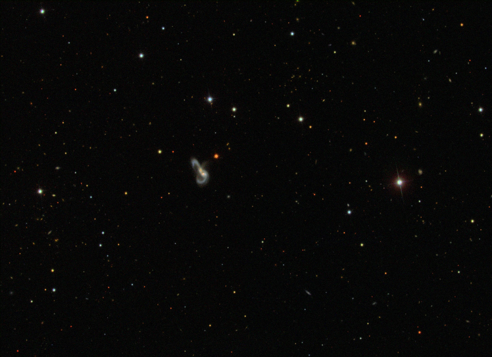
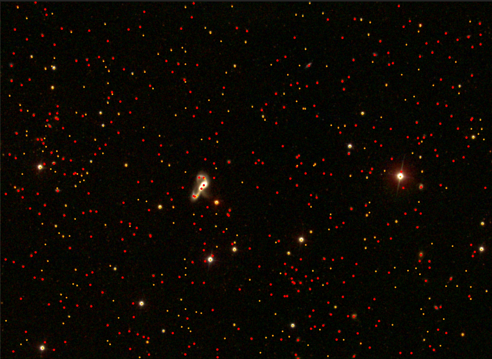
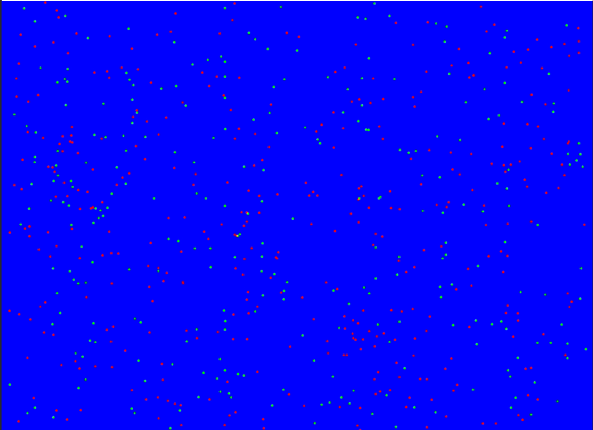

# Stars

This dataset is a collection of spectral band inputs of the Sloan Digital Sky Survey (SDSS).
It contains patches of the sky that can be used to classify if a specific coordinate is a star or a galaxy.

## The data

To get started we have to be a bit familiar with the SDSS file formats.
FITS stands for Flexible Image Transport System and is a astronomy community format endorsed by NASA.

To download a single band (in this case the R band) of a single patch of the sky run the following instruction:

``` bash
wget https://data.sdss.org/sas/dr17/eboss/photoObj/frames/301/3918/3/frame-r-003918-3-0213.fits.bz2
```

There are 4 more spectral bands for this image, each can be found by replacing 'r' with 'g' 'i' 'u' 'z'. To read briefly more about these bands go to: <https://skyserver.sdss.org/dr1/en/proj/advanced/color/sdssfilters.asp>. Notably only 2 of the bands are in human visual range, and more interestingly when plotting astronomical images the traditional 'RGB' is replaced with 'IRG'. An example of such is the below ---also provided by SDSS--- reconstructed image.



Example code to download all spectral bands:

``` bash
wget https://data.sdss.org/sas/dr17/eboss/photoObj/frames/301/3918/3/frame-irg-003918-3-0213.jpg
wget https://data.sdss.org/sas/dr17/eboss/photoObj/frames/301/3918/3/frame-r-003918-3-0213.fits.bz2
wget https://data.sdss.org/sas/dr17/eboss/photoObj/frames/301/2505/3/frame-g-003918-3-0213.fits.bz2
wget https://data.sdss.org/sas/dr17/eboss/photoObj/frames/301/2505/3/frame-i-003918-3-0213.fits.bz2
wget https://data.sdss.org/sas/dr17/eboss/photoObj/frames/301/2505/3/frame-u-003918-3-0213.fits.bz2
wget https://data.sdss.org/sas/dr17/eboss/photoObj/frames/301/2505/3/frame-z-003918-3-0213.fits.bz2
```

Download provided jpg of only 3 spectral bands

``` bash
wget https://data.sdss.org/sas/dr17/eboss/photoObj/frames/301/3918/3/frame-irg-003918-3-0213.jpg
```

## Combining Spectral Bands

The different spectral bands are not aligned perfectly.
To understand this, consider each band as a different picture taken in rapid succession pointing slightly differently at the sky.
This happens because nothing is stationary in the universe, e.g. earth is rotating around itself and the sun, and everything else is moving as well.

In practice this means that there are some minor differences at where each spectral band is pointing.
To figure out where, each fits file contain the following information:

<https://data.sdss.org/datamodel/files/BOSS_PHOTOOBJ/frames/RERUN/RUN/CAMCOL/frame.html>

For the purpose of training a classifier only HDU0 is required, but you could extract extra information.

HDU0 contains some information specificity about the orientation of the image.

``` txt
CRPIX1  float   X of reference pixel
CRPIX2  float   Y of reference pixel
CRVAL1  float   RA of reference pixel (deg)
CRVAL2  float   Dec of reference pixel (deg)
CD1_1   float   RA deg per column pixel
CD1_2   float   RA deg per row pixel
CD2_1   float   Dec deg per column pixel
CD2_2   float   Dec deg per row pixel
```

To align the images one can use these to calculate the offset for pixels to align with the other spectral bands. At the time of writing i use the r band as reference and align the other bands on top of it.

If one want to avoid the math exercise associated with aligning the images, <https://www.astropy.org/> in python can be used.

More specifically i suggest using the sub packages:

``` python
# For reading in fits files
from astropy.io import fits
# For containing real world coordinates vs pixel coordinates
from astropy.coordinates import SkyCoord
# World Coordinate System constructed from the spectral band files
from astropy.wcs import WCS 
```

## Star Coordinates

Associated with each image file there is 3 coordinate files.

- gal -- containing galaxy coordinates
- star -- containing star coordinates
- sky -- containing sky coordinates

each of these contain the real world coordinates associated with the images.

For the above spectral band

``` bash
wget https://data.sdss.org/sas/dr17/eboss/sweeps/dr13_final/301/calibObj-003918-3-gal.fits.gz
wget https://data.sdss.org/sas/dr17/eboss/sweeps/dr13_final/301/calibObj-003918-3-star.fits.gz
wget https://data.sdss.org/sas/dr17/eboss/sweeps/dr13_final/301/calibObj-003918-3-sky.fits.gz
```

See <https://data.sdss.org/datamodel/files/PHOTO_SWEEP/RERUN/calibObj.html> for a detailed description of the content.

Note that the data model is different for each of the files, in specific you need to extract the RA and Dec of each object and these fields are at different indexes for each file type.

For a prediction task we suggest using gal and star only.

## Bulk download commands

To download multiple images we suggest filling up a spec file that downloads each band and file specified.

``` bash
# Stars and Galaxies
wget --spider https://data.sdss.org/sas/dr17/eboss/sweeps/dr13_final/301/calibObj-008162-6-gal.fits.gz
wget --spider https://data.sdss.org/sas/dr17/eboss/sweeps/dr13_final/301/calibObj-008162-6-star.fits.gz

# Make a specification file ... you can fill this with files to download.
echo frame-r-008162-6-0080.fits.bz2 >  spec-list.txt 
echo frame-g-008162-6-0080.fits.bz2 >> spec-list.txt
echo frame-i-008162-6-0080.fits.bz2 >> spec-list.txt
echo frame-u-008162-6-0080.fits.bz2 >> spec-list.txt
echo frame-z-008162-6-0080.fits.bz2 >> spec-list.txt
echo frame-irg-008162-6-0080.jpg    >> spec-list.txt

# All images for these stars
wget --spider -i spec-list.txt -r --no-parent -nd -B 'https://data.sdss.org/sas/dr17/eboss/photoObj/frames/301/8162/6/'
```

Note Spider specify test download to not download. Remove that part if you actually have room and want to download it.

Note each band is in the range of 3 to 4 MB compressed, and 12.4 MB uncompressed, giving in total 62 MB data for each frame downloaded.
Furthermore the star and gals each in this example fill 30.6 MB and 33.7 MB uncompressed, but they contain the stars and galaxies for all images in ```frame-*-008162-6-*.fits.bz2```.

To see thumbnails of all images in ```frame-*-008162-6-*.fits.bz2``` here is a handy homepage:

<https://data.sdss.org/sas/dr17/eboss/photoObj/frames/301/8162/frames-run-008162.html>

**Note we downloaded Rerun 301 Run 8162 CamCol 6 Image 80.**

## **### IMPORTANT ###**

Do not overload the servers that provide the images. Since it is free and the servers providing them are ... getting older.
If you can download only once and share the images internally please do.

Once you have preprocessing pipelines reduce the size of the images.

If your download aborted try using 'rsync' to only download the images that you are missing, here is a guide:

<https://www.sdss4.org/dr17/data_access/bulk/>

## Example provided

Here is a description of a possible preprocessing output of the original files.

- [003918-3-0213_gals.csv](./003918-3-0213_gals.csv)
- [003918-3-0213_stars.csv](./003918-3-0213_stars.csv)

Csv files containing the pixel coordinates of the stars and galaxies.

- [003918-3-0213_img.pkl.bz2](./003918-3-0213_img.pkl.bz2)

The file 003918-3-0213_img.pkl.bz2 contains a the combined 5 channel image of the example, extracted and aligned.

Once decompressed it can be loaded and plotted like so:

```python
import matplotlib.pyplot as plt
import pickle as pkl
import numpy as np

with open("003918-3-0213_img.pkl", "rb") as f:
    nn_img = pkl.load(f) 

img = nn_img[:,:,:3] # take irg channels for plotting
img = np.maximum(0, img)
img = np.power(img, 0.5) # square root to make the high value pixels less dominant
plt.figure()
plt.axis("off")
plt.subplots_adjust(left=0.0, right=1.0, top=1.0, bottom=0.0, wspace=0.0, hspace=0.0)
plt.imshow(img)
plt.savefig("003918-3-0213_img.pdf")
```

- [frame-irg-003918-3-0213-marked.jpg](./frame-irg-003918-3-0213-marked.jpg)
- [frame-003918-3-0213-target.jpg](./frame-003918-3-0213-target.jpg)

A example of a combined image marking stars and galaxies. (red galaxies, orange stars)



An example of a machine learning target to predict (blue is nothing, green is stars, red is galaxies and yellow is overlapping),


